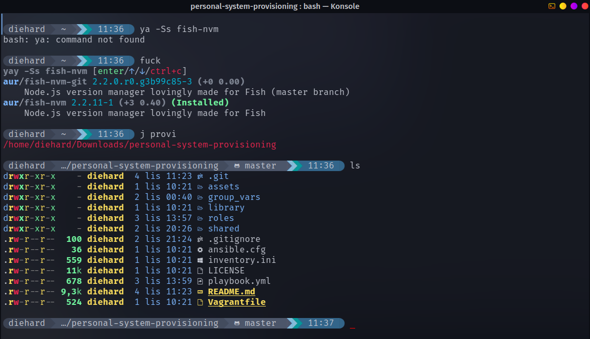
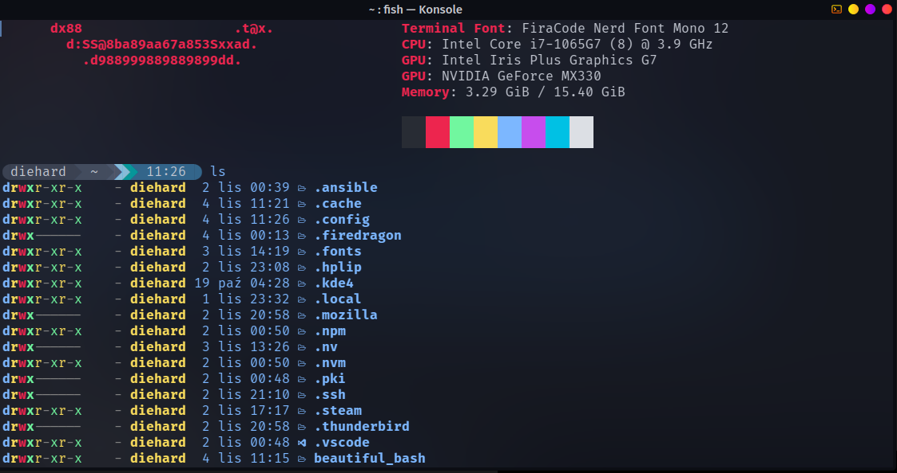
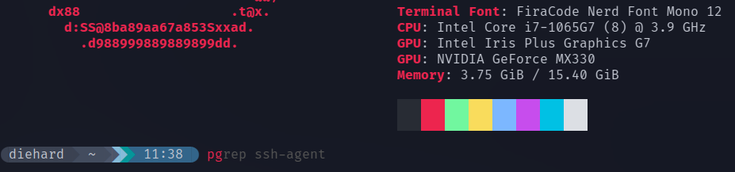

<!-- MARKDOWN LINKS & IMAGES -->

<!-- CHANGE THIS: PROJECT_URL, REPO_NAME -->
<!-- LOGO https://hatchful.shopify.com -->

[status-icon]: https://img.shields.io/badge/status-active-success.svg
[project-url]: https://github.com/DamianTab/personal-system-provisioning
[issues-icon]: https://img.shields.io/github/issues/DamianTab/personal-system-provisioning.svg
[issues-url]: https://github.com/DamianTab/personal-system-provisioning/issues
[pulls-icon]: https://img.shields.io/github/issues-pr/kylelobo/The-Documentation-Compendium.svg
[pulls-url]: https://github.com/DamianTab/personal-system-provisioning/pulls
[license-icon]: https://shields.io/badge/license-Apache%202-blue.svg
[license-url]: /LICENSE
[author-url]: https://github.com/DamianTab

<p align="center">
  <a href="" rel="noopener">
 </a>
</p>


<h3 align="center">Personal system provisioning</h3>

<div align="center">
  
  [![Status][status-icon]][project-url]
  [![GitHub Issues][issues-icon]][issues-url]
  [![GitHub Pull Requests][pulls-icon]][pulls-url]
  [![License][license-icon]][license-url]
</div>

---

<p align="center"> Few lines describing your project.
    <br> 
</p>

## 📝 Table of Contents
- [About](#about)
- [Technologies](#technologies)
- [Getting Started](#getting_started)
- [Usage](#usage)
- [TODO](#todo)
- [Authors](#authors)
- [Acknowledgments](#acknowledgement)

<br/>

## 🧐 About <a name = "about"></a>
This project provision all necessary programs and libs for ARCH distribution linux with Ansible tool. It installs necessary developers tools, every-day-use programs and more ! Testing machine is based on Manjaro - you can always check the results of this project without destroying your own system. After you are convinced, just proceed to local installation.

<br/>

## ⛏️ Technologies <a name = "technologies"></a>
- Ansible
- Vagrant

<br/>
  
## 🏁 Getting Started <a name = "getting_started"></a>
  
### Prerequisites
What things you need to install the software and how to install them.

```
Required:
- Ansible
- ansible-lint

Optionally (for test purposes):
- Vagrant
- Oracle Virtualbox
```

<br/>

### Installing
Install and configure Vagrant & [Oracle VirtualBox](https://www.virtualbox.org/) locally
```
# if from a different Linux distribution or on a Mac make sure to install Vagrant and Oracle
# if you are using a Garuda/Manjaro/Arch, install and configure Vagrant & Oracle VirtualBox locally
ansible-playbook playbook.yml -l localhost --extra-vars="user_name=USERNAME user_git_name=GIT_USERNAME" --ask-become-pass --tags virtualization
```
<br/>

## 🎈 Usage <a name="usage"></a>

### Manjaro Vagrant VM
#### Provision and configure a Manjaro Vagrant VM

```
vagrant up --provision
```

#### Run Ansible playbook against the Vagrant VM
```
ansible-lint
ansible-playbook -vv playbook.yml -l testmachine --ask-become-pass | tee ansible.log
```

#### Install everything (execute all roles)

```
ansible-playbook -vv playbook.yml -l testmachine --extra-vars="pritner_ip_addr=IP_ADDR user_name=USER git_user_name=GIT_USER git_user_email=GIT_EMAIL konsave_profile=diehard"  --ask-become-pass --tags all,drivers,bash,fish,desktop,developer,virtualization,cloud,tor | tee ansible.log
```

<br/>

### Localhost machine
#### Run Ansible playbook against localhost
```
ansible-lint
ansible-playbook -vv playbook.yml -l localhost --ask-become-pass | tee ansible.log
```

#### Install everything (execute all roles)

```
ansible-playbook -vv playbook.yml -l localhost --extra-vars="pritner_ip_addr=IP_ADDR user_name=USER git_user_name=GIT_USER git_user_email=GIT_EMAIL konsave_profile=diehard"  --ask-become-pass --tags all,drivers,bash,fish,desktop,developer,virtualization,cloud,tor | tee ansible.log
```

## :toolbox: Playbook Roles

Roles supported:

|        Roles       | always | never |                 arguments                |                                                                                   Description                                                                                   |
|:------------------:|:------:|:-----:|:----------------------------------------:|:-------------------------------------------------------------------------------------------------------------------------------------------------------------------------------:|
|        core        |    x   |   x   |                     x                    | Install Linux util libraries, python-pip, xinput, gcc, glib, pamac etc.                                                                                                         |
|       drivers      |    x   |  yes  |              pritner_ip_addr             | (Optional) Install printer drivers 'hplip' and nvidia GPU switcher 'nvidia-prime' -> https://wiki.garudalinux.org/en/optimus-device                                                                                                |
|        bash        |    x   |  yes  |                 user_name                | (Optional) Install [beautiful bash](#beautiful_bash), add amazing plugins, colors and some useful aliases in .bashrc -> e.g. autojump (https://github.com/wting/autojump), starship (https://starship.rs/) |
|        fish        |    x   |  yes  |                 user_name                | (Optional) Configure [fish] for Garuda linux OS - beautiful shell with nice autocompletion |
|       desktop      |    x   |  yes  |        user_name, konsave_profile        | (Optional) Install konsave with my KDE settings like shortcuts, widgets etc., install and configure conky. Please specify which konsave profile you want to install: 'diehard_conky' or 'diehard_widgets' (prepared with some widgets) |
|      security      |    x   |   x   |                     x                    | Install clamav, clamtk, ufw, ufw-extras and gufw. Configure all deamons and refresh virus database                                                                              |
|      developer     |    x   |  yes  | user_name, git_user_name, git_user_email | Install all necessary programmers tools like vscode, jetbrains, docker, kubernetes, maven, npm etc. and environments for java, go, nodejs.                                      |
|   virtualization   |    x   |  yes  |                     x                    | Install vagrant, virtualbox and virtualbox-host-modules                                                                                                                         |
|     virt_kernel    |    x   |  yes  |                     x                    | (Optional) Load kernel modules with modprobe. Optional step if virtualization is not working. Loads vboxdrv, vboxnetadp, vboxnetflt kernel module                               |
|        cloud       |    x   |  yes  |                 user_name                | (Optional) Install AWS CLI.                                                                                                                                                     |
|      browsers      |    x   |   x   |                     x                    | Install google-chrome, brave                                                                                                                                                    |
|    communicators   |    x   |   x   |                     x                    | Install slack and discord.                                                                                                                                                      |
|        media       |    x   |   x   |                     x                    | Install audacity, gimp, vlc player, spotify etc.                                                                                                                                |
|         tor        |    x   |   x   |                     x                    | Install necessary tools for tor browser.                                                                                                                                        |
| update_and_upgrade |   yes  |   x   |                     x                    | Update and upgrade system with all libraries                                                                                                                                    |


Roles with attribute always will always be executed, those with never has to be pointed out explicitly. Rest is under default option (no need to explicit select roles) or under default role called "all". For example to execute all default roles and install drivers (optional role) must run:

```
ansible-playbook -vv playbook.yml -l localhost --extra-vars="pritner_ip_addr=IP_ADDR"  --ask-become-pass --tags all,drivers
```


Example on how to install only browsers:
```
ansible-playbook playbook.yml --ask-become-pass --tags browsers
```

### Beautiful Bash Example

<p align="center">
  <a name = "beautiful_bash"></a>
 </a>
</p>

### Fish Example

<p align="center">
  <a name = "fish"></a>
 </a>
</p>

<p align="center">
 </a>
</p>

<br/>

## :notebook: Troubleshooting <a name = "todo"></a>
- Q: I don't see any widgets and your wallpaper
  A: Please before applying role 'desktop' check your `activityId` in /home/{{username}}/.config/plasma-org.kde.plasma.desktop-appletsrc in `[Containments][1]` (responsible element for Desktop). Copy this id e.g. `activityId=53b6f5ec-254c-459a-81a8-7fd6681b4e0b`. After applying konsave settings (before restart) replace the activityId in /home/{{username}}/.config/plasma-org.kde.plasma.desktop-appletsrc with this in clipboard.

  Remeber these konsave settings are only for clean buil - clean desktop without icons -> other way plasmashell will throw errors in consequence will not show any widgets
 


<br/>

## :notebook: TODO <a name = "todo"></a>
- todo list


<br/>

## ✍️ Authors <a name = "authors"></a>
- [@DamianTab][author-url]

<br/>

## 🎉 Acknowledgements <a name = "acknowledgement"></a>
- [Beautiful Bash by Chris Titus][https://github.com/christitustech/mybash]
